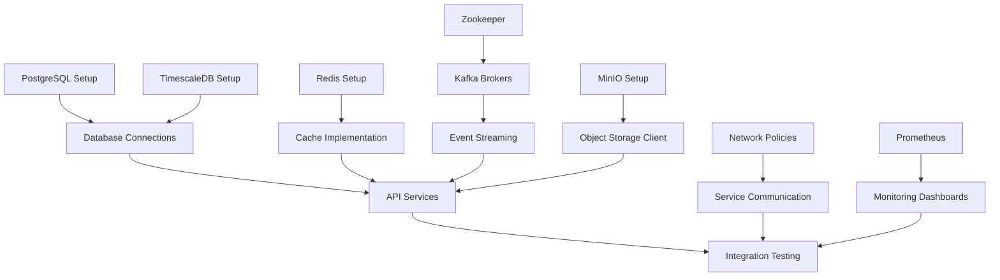

# Agent Team Assignments for Infrastructure Implementation

## Team Structure & Responsibilities

### 🤖 Available Agent Teams

#### 1. **Python Pro Team**
- **Expertise**: Python 3.12+, async programming, type safety, data science
- **Assigned Components**:
  - Database connection services (SQLAlchemy, asyncpg)
  - MinIO storage client implementation
  - Camera integration services (RTSP/WebRTC)
  - External API clients (Emergency, Traffic, GIS)
  - Redis client implementations

#### 2. **Platform Engineer Team**
- **Expertise**: Kubernetes, Docker, Terraform, GitOps, monitoring
- **Assigned Components**:
  - All Kubernetes StatefulSets and Services
  - Prometheus/Grafana monitoring stack
  - Terraform infrastructure modules
  - Helm charts and GitOps setup
  - Network policies and service mesh

#### 3. **Backend Developer Team**
- **Expertise**: FastAPI, microservices, API development
- **Assigned Components**:
  - API gateway configuration
  - Service discovery implementation
  - Health check endpoints
  - Integration middleware

#### 4. **Security Engineer Team**
- **Expertise**: Zero-trust, encryption, compliance, vulnerability management
- **Assigned Components**:
  - Vault secret management
  - Network security policies
  - Certificate management
  - RBAC configurations
  - Security scanning pipelines

#### 5. **Machine Learning Engineer Team**
- **Expertise**: PyTorch, YOLO11, model serving, GPU optimization
- **Assigned Components**:
  - GPU monitoring setup
  - Model storage in MinIO
  - Inference pipeline configuration
  - Performance benchmarking

#### 6. **CV Inference Optimizer Team**
- **Expertise**: YOLO11 deployment, real-time inference, TensorRT
- **Assigned Components**:
  - Camera stream processing optimization
  - Batch inference configuration
  - GPU memory management
  - Frame buffering in Redis

---

## Parallel Implementation Schedule

### 🚀 Sprint 1: Core Infrastructure (3 Days)

#### Day 1: Foundation Setup
**Morning (08:00-12:00)**
```yaml
Platform_Engineer_Team:
  tasks:
    - TASK-DB-001: PostgreSQL StatefulSet
    - TASK-MSG-001: Zookeeper deployment
    - TASK-IAC-001: Start Terraform modules
  
Python_Pro_Team:
  tasks:
    - TASK-DB-003: Database init scripts
    - TASK-STORAGE-003: MinIO client service
    - TASK-EXT-001: Camera connectors

Security_Engineer_Team:
  tasks:
    - TASK-SEC-001: Network policies
    - TASK-SEC-002: Start Vault setup

ML_Engineer_Team:
  tasks:
    - TASK-MON-002: GPU monitoring setup
```

**Afternoon (13:00-17:00)**
```yaml
Platform_Engineer_Team:
  tasks:
    - TASK-DB-004: TimescaleDB deployment
    - TASK-STORAGE-001: MinIO StatefulSet
    - TASK-MON-001: Prometheus operator

Python_Pro_Team:
  tasks:
    - TASK-DB-002: PgBouncer implementation
    - TASK-EXT-002: Camera discovery service
    
Backend_Developer_Team:
  tasks:
    - Health check endpoints for databases
    - Service discovery registration

CV_Inference_Optimizer_Team:
  tasks:
    - Frame buffer design in Redis
    - Stream processing architecture
```

#### Day 2: Service Integration
**Morning (08:00-12:00)**
```yaml
Platform_Engineer_Team:
  tasks:
    - TASK-DB-006: Redis cluster with Sentinel
    - TASK-MSG-002: Kafka brokers deployment
    - TASK-MON-003: Grafana dashboards

Python_Pro_Team:
  tasks:
    - TASK-DB-007: Redis configurations
    - TASK-EXT-003: Emergency services API
    - TASK-MSG-004: Redis Streams setup

Security_Engineer_Team:
  tasks:
    - TASK-SEC-002: Complete Vault setup
    - TASK-SEC-003: Cert-manager deployment

ML_Engineer_Team:
  tasks:
    - Model registry in MinIO
    - Inference metrics collection
```

**Afternoon (13:00-17:00)**
```yaml
Platform_Engineer_Team:
  tasks:
    - TASK-MSG-003: Kafka topics creation
    - TASK-IAC-002: Helm charts development
    - TASK-MON-004: Loki deployment

Python_Pro_Team:
  tasks:
    - TASK-EXT-004: Traffic system API
    - TASK-EXT-005: GIS integration
    - TASK-STORAGE-002: MinIO policies

Backend_Developer_Team:
  tasks:
    - API gateway routes
    - Service mesh integration
    
CV_Inference_Optimizer_Team:
  tasks:
    - Batch processing pipeline
    - GPU memory optimization
```

#### Day 3: Testing & Validation
**Morning (08:00-12:00)**
```yaml
All_Teams_Integration_Testing:
  Platform_Engineer:
    - Failover testing
    - Load testing infrastructure
    - Backup/restore procedures
  
  Python_Pro:
    - Integration tests for all clients
    - Performance benchmarking
    - Connection pool testing
  
  Security_Engineer:
    - Security scanning
    - Penetration testing
    - Compliance validation
  
  ML_Engineer:
    - Model serving tests
    - GPU utilization tests
    - Inference latency tests
```

**Afternoon (13:00-17:00)**
```yaml
Documentation_and_Handoff:
  All_Teams:
    - Runbook creation
    - Deployment guides
    - API documentation
    - Performance reports
    - Security audit reports
```

---

## Task Dependencies & Critical Path



---

## Agent Invocation Commands

### Python Pro Tasks
```bash
# Database initialization scripts
@agent-python-pro implement database initialization scripts for PostgreSQL and TimescaleDB based on schema in docs/

# MinIO client service
@agent-python-pro create MinIO storage client with async operations, multipart upload, and connection pooling

# Camera connectors
@agent-python-pro implement RTSP and WebRTC camera connectors with reconnection logic and frame buffering

# External API clients
@agent-python-pro create async API clients for emergency services, traffic management, and GIS systems
```

### Platform Engineer Tasks
```bash
# Kubernetes deployments
@agent-platform-engineer create StatefulSets for PostgreSQL, TimescaleDB, Redis, Kafka, and MinIO

# Monitoring stack
@agent-platform-engineer deploy Prometheus operator with ServiceMonitors and Grafana dashboards

# Terraform modules
@agent-platform-engineer create Terraform modules for AWS EKS cluster with GPU nodes

# Helm charts
@agent-platform-engineer create production Helm charts with proper resource limits and security settings
```

### Backend Developer Tasks
```bash
# API Gateway
@agent-backend-developer implement FastAPI gateway with authentication and rate limiting

# Health checks
@agent-backend-developer create health check endpoints for all infrastructure services

# Service discovery
@agent-backend-developer implement service discovery and registration system
```

### Security Engineer Tasks
```bash
# Network security
@agent-security-engineer create Kubernetes network policies and Istio service mesh configuration

# Secret management
@agent-security-engineer deploy HashiCorp Vault with auto-unseal and Kubernetes auth

# Certificate management
@agent-security-engineer setup cert-manager with Let's Encrypt for TLS certificates
```

### ML Engineer Tasks
```bash
# GPU monitoring
@agent-machine-learning-engineer setup NVIDIA DCGM exporter and GPU metrics collection

# Model registry
@agent-machine-learning-engineer implement model versioning and storage in MinIO

# Performance benchmarks
@agent-machine-learning-engineer create inference performance benchmarking suite
```

### CV Inference Optimizer Tasks
```bash
# Stream processing
@agent-cv-inference-optimizer optimize camera stream processing with frame buffering

# Batch inference
@agent-cv-inference-optimizer implement efficient batch processing for YOLO11

# GPU optimization
@agent-cv-inference-optimizer optimize GPU memory usage and inference throughput
```

---

## Success Metrics Per Team

### Python Pro Team
- ✅ All database clients < 10ms latency
- ✅ MinIO upload/download > 100MB/s
- ✅ Camera connections stable for 24h+
- ✅ 100% test coverage for critical paths

### Platform Engineer Team
- ✅ All pods running and healthy
- ✅ Zero unscheduled downtime
- ✅ Autoscaling working correctly
- ✅ Backup/restore < 15 minutes

### Security Engineer Team
- ✅ Zero high/critical vulnerabilities
- ✅ All traffic encrypted (mTLS)
- ✅ Secrets never exposed in logs
- ✅ RBAC properly configured

### ML Engineer Team
- ✅ GPU utilization > 80%
- ✅ Model loading < 5 seconds
- ✅ Inference latency < 100ms
- ✅ Memory usage stable

---

## Communication Matrix

| Team | Slack Channel | Daily Standup | Team Lead |
|------|--------------|---------------|-----------|
| Python Pro | #team-python-pro | 09:00 UTC | @python-pro-lead |
| Platform Engineer | #team-platform | 09:15 UTC | @platform-lead |
| Backend Developer | #team-backend | 09:30 UTC | @backend-lead |
| Security Engineer | #team-security | 09:45 UTC | @security-lead |
| ML Engineer | #team-ml | 10:00 UTC | @ml-lead |
| CV Optimizer | #team-cv | 10:15 UTC | @cv-lead |

---

## Risk Mitigation

### High-Risk Items
1. **Database replication lag** - Platform Engineer monitors
2. **Kafka broker failure** - Platform Engineer implements HA
3. **GPU memory leaks** - CV Optimizer implements monitoring
4. **Network policy conflicts** - Security Engineer validates
5. **Secret exposure** - Security Engineer audits

### Contingency Plans
- Rollback procedures for each component
- Backup environments ready
- Manual failover procedures documented
- Emergency contact list maintained

This assignment ensures optimal utilization of each agent team's expertise while maintaining clear ownership and accountability for each infrastructure component.