# Infrastructure Implementation Task List

## Overview
Parallel implementation plan for ITS Camera AI infrastructure components based on C4 architecture diagrams and system context.

## Team Assignments & Task Distribution

### 🔵 Team 1: Core Database Infrastructure
**Lead Agent**: Platform Engineer
**Support**: Python Pro for connection pooling and ORM

#### Phase 1A: PostgreSQL Primary Database (Day 1-2)
- [ ] **TASK-DB-001**: Create PostgreSQL StatefulSet with primary-replica configuration
  - Primary database for user data, camera configs, incidents
  - 3 replicas with streaming replication
  - Persistent volumes: 100GB SSD per replica
  - Location: `infrastructure/kubernetes/databases/postgresql/`
  
- [ ] **TASK-DB-002**: Implement PostgreSQL connection pooling
  - PgBouncer deployment for connection management
  - Max connections: 200 per instance
  - Location: `infrastructure/kubernetes/databases/pgbouncer/`

- [ ] **TASK-DB-003**: Create database initialization scripts
  - Schema creation for all tables
  - Initial user and role setup
  - Location: `infrastructure/database/postgresql-init/`

#### Phase 1B: TimescaleDB for Metrics (Day 1-2)
- [ ] **TASK-DB-004**: Deploy TimescaleDB StatefulSet
  - Time-series database for performance metrics
  - Hypertables for camera_metrics, vehicle_detections
  - Continuous aggregates configuration
  - Location: `infrastructure/kubernetes/databases/timescaledb/`

- [ ] **TASK-DB-005**: Create TimescaleDB schemas and policies
  - Retention policies (30 days for metrics, 7 days for detections)
  - Compression policies for older data
  - Location: `infrastructure/database/timescale-init.sql`

#### Phase 1C: Redis Cluster (Day 2-3)
- [ ] **TASK-DB-006**: Deploy Redis with Sentinel for HA
  - 3 Redis masters, 3 replicas
  - Sentinel for automatic failover
  - Max memory: 8GB per instance
  - Location: `infrastructure/kubernetes/databases/redis/`

- [ ] **TASK-DB-007**: Configure Redis for different use cases
  - Session storage configuration
  - Message queue setup
  - Cache eviction policies
  - Location: `infrastructure/kubernetes/databases/redis/configs/`

---

### 🟢 Team 2: Messaging & Streaming Infrastructure
**Lead Agent**: Platform Engineer
**Support**: Python Pro for client libraries

#### Phase 2A: Kafka Cluster (Day 1-3)
- [ ] **TASK-MSG-001**: Deploy Zookeeper StatefulSet
  - 3 Zookeeper instances for Kafka coordination
  - Persistent volumes: 10GB each
  - Location: `infrastructure/kubernetes/messaging/zookeeper/`

- [ ] **TASK-MSG-002**: Deploy Kafka StatefulSet
  - 3 Kafka brokers with rack awareness
  - Topics: camera-events, vehicle-detections, alerts
  - Retention: 7 days, replication factor: 2
  - Location: `infrastructure/kubernetes/messaging/kafka/`

- [ ] **TASK-MSG-003**: Create Kafka topic management
  - Auto-create topics with proper partitions
  - Topic configurations for different event types
  - Location: `infrastructure/kubernetes/messaging/kafka/topics/`

#### Phase 2B: Redis Streams (Day 2-3)
- [ ] **TASK-MSG-004**: Configure Redis Streams for real-time events
  - Stream keys for camera frames
  - Consumer groups for processors
  - Location: `infrastructure/kubernetes/messaging/redis-streams/`

---

### 🟡 Team 3: Object Storage Infrastructure
**Lead Agent**: Python Pro
**Support**: Platform Engineer for Kubernetes

#### Phase 3: MinIO Distributed Storage (Day 1-2)
- [ ] **TASK-STORAGE-001**: Deploy MinIO StatefulSet
  - 4 MinIO instances for distributed mode
  - Persistent volumes: 500GB each
  - Erasure coding for data protection
  - Location: `infrastructure/kubernetes/storage/minio/`

- [ ] **TASK-STORAGE-002**: Create MinIO bucket policies
  - Buckets: its-video, its-models, its-logs
  - Lifecycle policies for data retention
  - Location: `infrastructure/kubernetes/storage/minio/policies/`

- [ ] **TASK-STORAGE-003**: Implement MinIO client service
  - Python client with connection pooling
  - Multipart upload support
  - Location: `src/its_camera_ai/storage/minio_service.py`

---

### 🔴 Team 4: External Integrations
**Lead Agent**: Python Pro
**Support**: Backend Developer

#### Phase 4A: Camera Integration (Day 1-2)
- [ ] **TASK-EXT-001**: RTSP/WebRTC camera connectors
  - RTSP stream reader implementation
  - WebRTC peer connection manager
  - Location: `src/its_camera_ai/integrations/cameras/`

- [ ] **TASK-EXT-002**: Camera discovery service
  - ONVIF protocol support
  - Auto-discovery of IP cameras
  - Location: `src/its_camera_ai/services/camera_discovery.py`

#### Phase 4B: External Systems (Day 2-3)
- [ ] **TASK-EXT-003**: Emergency services integration
  - REST API client for emergency systems
  - Alert notification service
  - Location: `src/its_camera_ai/integrations/emergency/`

- [ ] **TASK-EXT-004**: Traffic management system integration
  - API client for traffic signals
  - Data synchronization service
  - Location: `src/its_camera_ai/integrations/traffic/`

- [ ] **TASK-EXT-005**: GIS system integration
  - Location data enrichment service
  - Geocoding and reverse geocoding
  - Location: `src/its_camera_ai/integrations/gis/`

---

### 🟣 Team 5: Monitoring & Observability
**Lead Agent**: Platform Engineer
**Support**: ML Engineer for GPU metrics

#### Phase 5A: Metrics Collection (Day 1-2)
- [ ] **TASK-MON-001**: Deploy Prometheus Operator
  - ServiceMonitors for all services
  - Recording rules for SLIs
  - Alert rules for critical metrics
  - Location: `infrastructure/kubernetes/monitoring/prometheus/`

- [ ] **TASK-MON-002**: Configure GPU monitoring
  - NVIDIA DCGM exporter
  - GPU utilization metrics
  - Location: `infrastructure/kubernetes/monitoring/gpu-metrics/`

#### Phase 5B: Visualization (Day 2-3)
- [ ] **TASK-MON-003**: Deploy Grafana with dashboards
  - System overview dashboard
  - Per-service dashboards
  - GPU utilization dashboard
  - Location: `infrastructure/kubernetes/monitoring/grafana/`

- [ ] **TASK-MON-004**: Configure Loki for logging
  - Log aggregation from all pods
  - Log retention policies
  - Location: `infrastructure/kubernetes/monitoring/loki/`

---

### 🟠 Team 6: Security & Networking
**Lead Agent**: Security Engineer
**Support**: Platform Engineer

#### Phase 6: Security Infrastructure (Day 1-3)
- [ ] **TASK-SEC-001**: Network policies
  - Ingress/egress rules for all namespaces
  - Service mesh configuration (Istio)
  - Location: `infrastructure/kubernetes/security/network-policies/`

- [ ] **TASK-SEC-002**: Secret management
  - Vault deployment and configuration
  - Sealed secrets for Kubernetes
  - Location: `infrastructure/kubernetes/security/vault/`

- [ ] **TASK-SEC-003**: Certificate management
  - Cert-manager deployment
  - Let's Encrypt integration
  - Location: `infrastructure/kubernetes/security/cert-manager/`

---

### 🔵 Team 7: Infrastructure as Code
**Lead Agent**: Platform Engineer
**Support**: DevOps Engineer

#### Phase 7: Terraform & Automation (Day 1-3)
- [ ] **TASK-IAC-001**: Terraform modules for AWS/GCP
  - VPC and networking module
  - EKS/GKE cluster module
  - RDS and ElastiCache modules
  - Location: `infrastructure/terraform/modules/`

- [ ] **TASK-IAC-002**: Helm charts for applications
  - Main application chart
  - Infrastructure services chart
  - Location: `infrastructure/helm/charts/`

- [ ] **TASK-IAC-003**: GitOps configuration
  - ArgoCD application definitions
  - Environment-specific overlays
  - Location: `infrastructure/gitops/`

---

## Parallel Execution Timeline

### Day 1 (All Teams Start)

```mermaid
gantt
    title Day 1 - Parallel Tasks
    dateFormat HH:mm
    section Database
    PostgreSQL Setup    :08:00, 4h
    TimescaleDB Setup   :08:00, 4h
    section Messaging
    Zookeeper Deploy    :08:00, 3h
    Kafka Planning      :11:00, 2h
    section Storage
    MinIO Deploy        :08:00, 4h
    section External
    Camera Connectors   :08:00, 4h
    section Monitoring
    Prometheus Setup    :08:00, 3h
    section Security
    Network Policies    :08:00, 4h
    section IaC
    Terraform Modules   :08:00, 4h
```

### Day 2 (Continue & Integration)

```mermaid
gantt
    title Day 2 - Integration Tasks
    dateFormat HH:mm
    section Database
    Redis Cluster       :08:00, 4h
    DB Integration      :12:00, 2h
    section Messaging
    Kafka Brokers       :08:00, 4h
    Redis Streams       :12:00, 2h
    section Storage
    MinIO Policies      :08:00, 2h
    Client Service      :10:00, 3h
    section External
    Emergency API       :08:00, 3h
    Traffic API         :11:00, 3h
    section Monitoring
    Grafana Setup       :08:00, 4h
    section Security
    Vault Setup         :08:00, 4h
    section IaC
    Helm Charts         :08:00, 4h
```

### Day 3 (Final Integration & Testing)

```mermaid
gantt
    title Day 3 - Testing & Validation
    dateFormat HH:mm
    section Integration
    Service Discovery   :08:00, 2h
    Health Checks       :10:00, 2h
    section Testing
    Load Testing        :12:00, 2h
    Failover Testing    :14:00, 2h
    section Documentation
    Runbooks            :08:00, 3h
    Deployment Guide    :11:00, 3h
```

---

## Success Criteria

### Per Component
- ✅ All services deployed and running
- ✅ Health checks passing
- ✅ Persistent storage configured
- ✅ High availability verified
- ✅ Security policies applied
- ✅ Monitoring metrics collected
- ✅ Backup procedures tested

### Integration Tests
- ✅ Database connections from services
- ✅ Message flow through Kafka
- ✅ Object storage operations
- ✅ External system connectivity
- ✅ Monitoring data visible
- ✅ Failover scenarios work

### Performance Targets
- Database response time: < 10ms
- Kafka throughput: > 100K messages/sec
- MinIO throughput: > 1Gbps
- Redis latency: < 1ms
- API response time: < 100ms

---

## Resource Requirements

### Kubernetes Cluster
- **Nodes**: 6 worker nodes minimum
- **CPU**: 48 vCPUs total
- **Memory**: 192GB total
- **Storage**: 2TB SSD total
- **GPU**: 2 NVIDIA T4 or better

### Network
- **Bandwidth**: 10Gbps internal
- **Load Balancer**: Layer 4 and Layer 7
- **DNS**: Internal service discovery

---

## Rollback Plan

Each component has rollback procedures:
1. Helm rollback for applications
2. Terraform state rollback for infrastructure
3. Database backup restoration
4. Configuration rollback via GitOps

---

## Communication Protocol

### Daily Sync
- 09:00: Team leads sync
- 14:00: Progress checkpoint
- 17:00: End-of-day status

### Slack Channels
- #infra-general
- #infra-databases
- #infra-messaging
- #infra-monitoring
- #infra-security

### Issue Tracking
- GitHub Issues with labels
- Team-specific project boards
- Daily standup notes

---

## Next Steps

1. **Immediate Actions**:
   - Create namespace structure
   - Set up service accounts
   - Configure RBAC permissions

2. **Team Formation**:
   - Assign team leads
   - Distribute task ownership
   - Set up communication channels

3. **Environment Setup**:
   - Development cluster ready
   - CI/CD pipelines configured
   - Monitoring dashboards prepared

This task list ensures parallel execution while maintaining proper dependencies and integration points between teams.