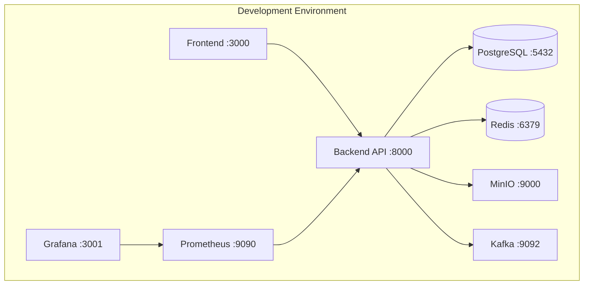
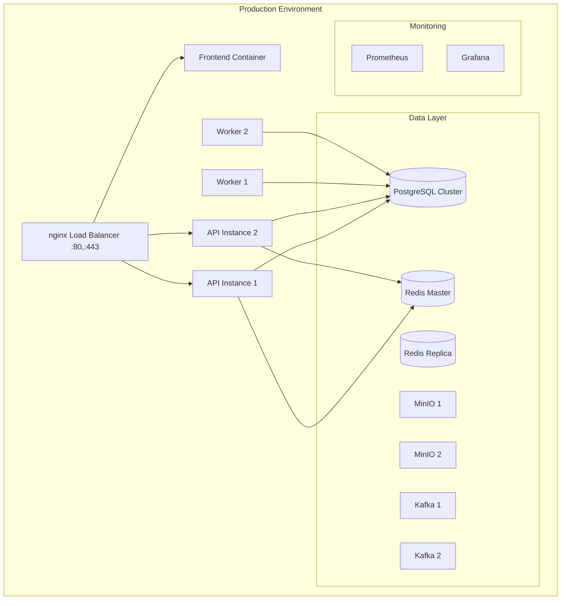

# ITS Camera AI - Docker Deployment Guide

This guide covers comprehensive Docker deployment configurations for the ITS Camera AI project, including development, staging, and production environments.

## 🚀 Quick Start

### Prerequisites

- Docker 20.10+ with BuildKit support
- Docker Compose 2.0+ (or Docker Compose Plugin)
- Minimum 8GB RAM, 4 CPU cores recommended
- 50GB+ available disk space for production

### Development Environment (Fastest Setup)

```bash
# Generate SSL certificates (optional)
./config/nginx/ssl/generate-dev-certs.sh

# Start all services
docker-compose up -d

# Or use the deployment script
./scripts/deploy-frontend.sh
```

Access points:
- **Frontend**: http://localhost:3000
- **API**: http://localhost:8000
- **Grafana**: http://localhost:3001

### Production Environment

```bash
# Copy and configure environment file
cp .env.docker.example .env.docker
# Edit .env.docker with your production values

# Start production services
./scripts/deploy-frontend.sh -e production -d

# Or manually
docker-compose -f docker-compose.prod.yml up -d
```

Access points:
- **Application**: https://localhost (with load balancer)
- **HTTP**: http://localhost (redirects to HTTPS)

## 📁 File Structure

```
├── docker-compose.yml              # Development environment
├── docker-compose.prod.yml         # Production environment
├── web/
│   ├── Dockerfile                  # Multi-stage frontend Dockerfile
│   ├── Dockerfile.test             # Testing-specific Dockerfile
│   └── docker-compose.test.yml     # Testing environment
├── config/
│   └── nginx/
│       ├── nginx.conf              # Production nginx configuration
│       ├── conf.d/
│       │   ├── security.conf       # Security headers
│       │   └── cache.conf          # Caching rules
│       └── ssl/
│           ├── generate-dev-certs.sh # SSL certificate generator
│           └── README.md           # SSL setup guide
├── scripts/
│   └── deploy-frontend.sh          # Comprehensive deployment script
└── .env.docker.example             # Environment configuration template
```

## 🏗️ Architecture Overview

### Development Architecture



### Production Architecture



## 🐳 Docker Images and Stages

### Frontend Dockerfile Stages

1. **base**: Common Node.js base with system dependencies
2. **deps**: Install all dependencies
3. **development**: Hot-reload development server
4. **builder**: Build production artifacts
5. **production-deps**: Production-only dependencies
6. **production**: Optimized production image
7. **testing**: Testing environment with Chromium
8. **staging**: Production-like with debugging tools

### Build Targets

```bash
# Development
docker build --target development -t its-camera-ai-frontend:dev ./web

# Production
docker build --target production -t its-camera-ai-frontend:prod ./web

# Testing
docker build --target testing -t its-camera-ai-frontend:test ./web
```

## 🔧 Configuration

### Environment Variables

Key environment variables for different stages:

#### Frontend Configuration
- `NODE_ENV`: Environment type (development|staging|production)
- `NEXT_PUBLIC_API_URL`: External API URL for browser
- `NEXT_PUBLIC_API_BASE_URL`: Internal API URL for SSR
- `NEXTAUTH_URL`: Authentication callback URL
- `NEXTAUTH_SECRET`: Authentication secret

#### Security Configuration
- `SECURE_COOKIES`: Enable secure cookies (production)
- `CSP_ENABLED`: Enable Content Security Policy
- `SSL_CERT_PATH`: SSL certificate path
- `SSL_KEY_PATH`: SSL private key path

#### Performance Configuration
- `NGINX_WORKER_PROCESSES`: Nginx worker count
- `NGINX_WORKER_CONNECTIONS`: Max connections per worker
- `NGINX_CLIENT_MAX_BODY_SIZE`: Max request body size

### SSL/TLS Setup

#### Development
```bash
# Generate self-signed certificates
./config/nginx/ssl/generate-dev-certs.sh

# Add to /etc/hosts
echo "127.0.0.1 its-camera-ai.local" | sudo tee -a /etc/hosts
```

#### Production
```bash
# Let's Encrypt (recommended)
certbot certonly --nginx -d your-domain.com

# Copy certificates
cp /etc/letsencrypt/live/your-domain.com/fullchain.pem config/nginx/ssl/cert.pem
cp /etc/letsencrypt/live/your-domain.com/privkey.pem config/nginx/ssl/key.pem
```

## 🚦 Load Balancing and Nginx

### Features

- **SSL Termination**: HTTPS with HTTP/2 support
- **Load Balancing**: Round-robin with health checks
- **Static File Serving**: Optimized asset delivery
- **Security Headers**: Comprehensive security configuration
- **Rate Limiting**: Protection against abuse
- **WebSocket Support**: Real-time communication proxy
- **Compression**: Gzip compression for all text assets
- **Caching**: Multi-level caching strategy

### Nginx Configuration Highlights

```nginx
# Backend upstream with health checks
upstream frontend_backend {
    least_conn;
    server frontend:3000 max_fails=3 fail_timeout=30s;
    keepalive 32;
}

# Rate limiting zones
limit_req_zone $binary_remote_addr zone=api:10m rate=100r/m;
limit_req_zone $binary_remote_addr zone=login:10m rate=5r/m;

# Security headers
add_header X-Frame-Options "SAMEORIGIN" always;
add_header X-Content-Type-Options "nosniff" always;
add_header Strict-Transport-Security "max-age=31536000; includeSubDomains; preload" always;
```

## 🔄 Health Checks

### Frontend Health Check

Endpoint: `GET /api/health`

Response format:
```json
{
  "status": "healthy",
  "timestamp": "2024-01-15T10:30:00.000Z",
  "version": "1.0.0",
  "environment": "production",
  "uptime": 3600,
  "checks": {
    "server": "ok",
    "memory": "ok",
    "api": "ok"
  }
}
```

### Docker Health Checks

```yaml
healthcheck:
  test: ["CMD", "curl", "-f", "http://localhost:3000/api/health"]
  interval: 30s
  timeout: 10s
  retries: 3
  start_period: 60s
```

## 📊 Monitoring and Logging

### Metrics Collection

- **Application Metrics**: Custom Next.js metrics
- **Infrastructure Metrics**: Docker container stats
- **Business Metrics**: User interactions, API performance
- **Security Metrics**: Failed authentication attempts, rate limit hits

### Log Aggregation

```yaml
logging:
  driver: "json-file"
  options:
    max-size: "10m"
    max-file: "3"
```

### Grafana Dashboards

Preconfigured dashboards for:
- Frontend performance metrics
- API response times
- Error rates and status codes
- Infrastructure resource usage
- Security events and alerts

## 🔐 Security Features

### Network Security
- Container isolation with custom networks
- No direct external access to databases
- SSL/TLS encryption for all external communication

### Application Security
- Content Security Policy (CSP)
- HTTP Strict Transport Security (HSTS)
- X-Frame-Options protection
- Rate limiting on authentication endpoints
- Input validation and sanitization

### Container Security
- Non-root user execution
- Minimal attack surface with Alpine Linux
- Regular security updates
- Secrets management via environment variables

## 🚀 Deployment Commands

### Development
```bash
# Quick start
./scripts/deploy-frontend.sh

# With specific options
./scripts/deploy-frontend.sh --env development --skip-ssl

# Manual approach
docker-compose up -d frontend
```

### Staging
```bash
# Deploy staging environment
./scripts/deploy-frontend.sh -e staging -d

# With SSL generation
./scripts/deploy-frontend.sh -e staging --generate-ssl
```

### Production
```bash
# Full production deployment
./scripts/deploy-frontend.sh -e production -d

# Build only (for CI/CD)
./scripts/deploy-frontend.sh -e production --build-only

# Clean deployment
./scripts/deploy-frontend.sh -e production --clean -d
```

## 🧪 Testing

### End-to-End Testing
```bash
# Run E2E tests in containers
docker-compose -f web/docker-compose.test.yml up --abort-on-container-exit

# Interactive testing
./scripts/deploy-frontend.sh --env testing
docker-compose -f web/docker-compose.test.yml exec puppeteer-runner yarn test:e2e:headed
```

### Performance Testing
```bash
# Load testing with built-in tools
docker-compose exec frontend yarn test:lighthouse
docker-compose exec frontend yarn test:performance
```

## 🔄 Scaling

### Horizontal Scaling

Add more frontend instances:
```yaml
frontend:
  deploy:
    replicas: 3
    update_config:
      parallelism: 1
      delay: 10s
    restart_policy:
      condition: on-failure
      delay: 5s
      max_attempts: 3
```

### Resource Scaling

Adjust resource limits:
```yaml
deploy:
  resources:
    limits:
      memory: 2GB
      cpus: '1.0'
    reservations:
      memory: 1GB
      cpus: '0.5'
```

## 🛠️ Troubleshooting

### Common Issues

#### 1. Port Conflicts
```bash
# Check port usage
sudo netstat -tulpn | grep :3000

# Change ports in docker-compose.yml
ports:
  - "3001:3000"  # Changed from 3000:3000
```

#### 2. SSL Certificate Issues
```bash
# Regenerate certificates
rm -f config/nginx/ssl/*.pem
./config/nginx/ssl/generate-dev-certs.sh

# Check certificate validity
openssl x509 -in config/nginx/ssl/cert.pem -text -noout
```

#### 3. Memory Issues
```bash
# Check container memory usage
docker stats

# Increase memory limits
# In docker-compose.yml under deploy.resources.limits
memory: 2GB
```

#### 4. Build Failures
```bash
# Clear Docker cache
docker system prune -a

# Rebuild with no cache
docker-compose build --no-cache frontend
```

### Debug Commands

```bash
# View logs
docker-compose logs -f frontend
docker-compose logs -f nginx

# Shell access
docker-compose exec frontend sh
docker-compose exec nginx sh

# Health status
curl -s http://localhost:3000/api/health | jq
curl -s http://localhost/frontend-health | jq

# Network inspection
docker network ls
docker network inspect its-camera-ai-network
```

## 📝 Maintenance

### Regular Maintenance Tasks

1. **Update Dependencies**
   ```bash
   cd web && yarn upgrade
   docker-compose build --no-cache frontend
   ```

2. **Rotate SSL Certificates**
   ```bash
   certbot renew
   docker-compose restart nginx
   ```

3. **Clean Docker Resources**
   ```bash
   docker system prune -a
   docker volume prune
   ```

4. **Backup Data**
   ```bash
   docker-compose exec postgres pg_dump -U its_camera_ai its_camera_ai > backup.sql
   ```

### Performance Monitoring

- Monitor resource usage with `docker stats`
- Check application metrics in Grafana
- Review nginx access logs for performance patterns
- Monitor error rates and response times

## 🔗 Related Documentation

- [Frontend Development Guide](../web/README.md)
- [API Documentation](../docs/api.md)
- [Security Guidelines](../docs/security.md)
- [Monitoring Setup](../docs/monitoring.md)

## 📞 Support

For deployment issues or questions:
1. Check the troubleshooting section above
2. Review container logs for error details
3. Consult the project documentation
4. File an issue with deployment details

---

*Last updated: January 2024*