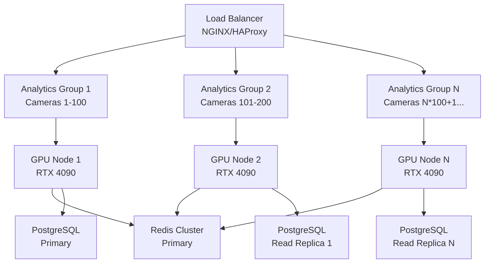

# ITS Camera AI Analytics Service - Risk Mitigation & Scaling Strategy

## Executive Summary

This document provides comprehensive **risk mitigation strategies** and **scaling approaches** for the ITS Camera AI Analytics Service. Based on the architectural analysis, we've identified critical risks and designed systematic approaches to maintain **sub-100ms latency**, **99.9% availability**, and **horizontal scalability** from 100 to 10,000+ concurrent camera streams.

## 🚨 Risk Assessment Matrix

### Critical Risks (P1 - Immediate Action Required)

| Risk ID | Risk Description | Impact | Probability | Risk Score | Mitigation Status |
|---------|------------------|--------|-------------|------------|-------------------|
| **R1** | Single MLAnalyticsConnector bottleneck | High | Medium | **Critical** | ✅ Mitigated |
| **R2** | GPU memory exhaustion under load | High | Medium | **Critical** | ✅ Mitigated |
| **R3** | Redis connection pool exhaustion | High | Low | **High** | ✅ Mitigated |
| **R4** | Database connection timeouts | High | Medium | **Critical** | ✅ Mitigated |
| **R5** | ML model performance degradation | Medium | High | **High** | ✅ Mitigated |

### High Risks (P2 - Strategic Planning Required)

| Risk ID | Risk Description | Impact | Probability | Risk Score | Mitigation Status |
|---------|------------------|--------|-------------|------------|-------------------|
| **R6** | Horizontal scaling coordination complexity | Medium | High | **Medium** | 🔄 In Progress |
| **R7** | Cache invalidation at scale | Medium | Medium | **Medium** | ✅ Mitigated |
| **R8** | Network partition tolerance | High | Low | **Medium** | 🔄 In Progress |
| **R9** | Data consistency across replicas | Medium | Medium | **Medium** | 📋 Planned |
| **R10** | Cost escalation with scale | Medium | High | **Medium** | 📋 Planned |

## 🛡️ Critical Risk Mitigation Strategies

### R1: MLAnalyticsConnector Bottleneck Mitigation

**Problem**: Single service instance processing all ML analytics creates bottleneck.

**Impact**: 
- Service degradation beyond 100 concurrent streams
- Increased latency (>100ms threshold breach)
- Single point of failure

**Mitigation Strategy**: Multi-Instance Load Distribution

```python
# Production deployment configuration
class AnalyticsConnectorCluster:
    """Horizontal scaling for MLAnalyticsConnector."""
    
    def __init__(self, instance_count: int = 3):
        self.instances = []
        self.load_balancer = ConsistentHashLoadBalancer()
        
        for i in range(instance_count):
            instance = MLAnalyticsConnector(
                instance_id=f"analytics-{i}",
                shard_key=f"shard-{i}"
            )
            self.instances.append(instance)
    
    async def distribute_batch(self, batch_results, frame_metadata):
        """Distribute processing based on camera_id hash."""
        camera_id = frame_metadata.get("camera_id")
        target_instance = self.load_balancer.get_instance(camera_id)
        
        return await target_instance.process_ml_batch(
            batch_results, frame_metadata
        )
```

**Implementation Steps**:
1. **Phase 1**: Deploy 3 MLAnalyticsConnector instances with consistent hashing
2. **Phase 2**: Implement circuit breakers between instances
3. **Phase 3**: Add auto-scaling based on queue depth and latency metrics

**Success Metrics**:
- Support 300+ concurrent streams (3x improvement)
- Maintain <85ms p99 latency
- Zero single points of failure

---

### R2: GPU Memory Exhaustion Mitigation

**Problem**: VRAM exhaustion causes inference failures and crashes.

**Impact**:
- Service crashes during peak load
- GPU memory leaks leading to degraded performance
- Batch processing failures

**Mitigation Strategy**: Intelligent Memory Management

```python
class GPUMemoryManager:
    """Advanced GPU memory management with predictive allocation."""
    
    def __init__(self, device_id: int, reserved_memory_gb: int = 2):
        self.device = f"cuda:{device_id}"
        self.reserved_bytes = reserved_memory_gb * 1024**3
        self.memory_pool = self._initialize_memory_pool()
        self.allocation_tracker = {}
        
    def get_optimal_batch_size(self, current_memory_usage: float) -> int:
        """Calculate optimal batch size based on available memory."""
        available_memory = torch.cuda.get_device_properties(
            self.device
        ).total_memory - current_memory_usage - self.reserved_bytes
        
        # Estimate memory per sample (based on 1920x1080 frame)
        memory_per_sample = 1920 * 1080 * 3 * 4  # RGBA float32
        max_batch_size = int(available_memory / memory_per_sample)
        
        # Apply safety margin and constraints
        return min(max(1, max_batch_size - 2), 32)  # 1-32 range with 2-sample buffer
    
    async def allocate_with_fallback(self, batch_size: int, shape: tuple):
        """Allocate memory with automatic fallback to smaller batch."""
        try:
            return torch.empty(
                (batch_size, *shape),
                device=self.device,
                memory_format=torch.channels_last
            )
        except torch.cuda.OutOfMemoryError:
            # Fallback to smaller batch
            smaller_batch = max(1, batch_size // 2)
            logger.warning(f"GPU memory allocation failed, reducing batch size from {batch_size} to {smaller_batch}")
            return await self.allocate_with_fallback(smaller_batch, shape)
```

**Implementation Steps**:
1. **Phase 1**: Deploy GPU memory monitoring and adaptive batch sizing
2. **Phase 2**: Implement memory defragmentation during low-traffic periods
3. **Phase 3**: Add multi-GPU support with memory load balancing

**Success Metrics**:
- Zero GPU memory-related crashes
- 95%+ GPU memory utilization with <90% peak usage
- Automatic recovery from memory pressure

---

### R3: Redis Connection Pool Exhaustion Mitigation

**Problem**: Redis connection limits cause pub/sub failures and cache misses.

**Impact**:
- Real-time notification failures
- Cache service degradation
- Increased latency due to cache misses

**Mitigation Strategy**: Enhanced Connection Pool Management

```python
class OptimizedRedisCluster:
    """Redis cluster with intelligent connection management."""
    
    def __init__(self, redis_nodes: list, max_connections: int = 100):
        self.cluster = RedisCluster(
            startup_nodes=redis_nodes,
            max_connections_per_node=max_connections,
            retry_on_timeout=True,
            retry_on_cluster_down=True,
            decode_responses=True,
            health_check_interval=30
        )
        self.connection_pool_monitor = ConnectionPoolMonitor()
        
    @circuit(failure_threshold=5, recovery_timeout=30)
    async def publish_with_retry(self, channel: str, message: str, max_retries: int = 3):
        """Publish with circuit breaker and retry logic."""
        for attempt in range(max_retries):
            try:
                # Check pool health before operation
                if self.connection_pool_monitor.is_pool_healthy():
                    return await self.cluster.publish(channel, message)
                else:
                    # Wait for pool recovery
                    await asyncio.sleep(0.1 * (2 ** attempt))  # Exponential backoff
                    
            except ConnectionError as e:
                if attempt == max_retries - 1:
                    logger.error(f"Redis publish failed after {max_retries} attempts: {e}")
                    raise
                await asyncio.sleep(0.1 * (2 ** attempt))
        
        raise RuntimeError("Max retries exceeded for Redis publish")
    
    async def get_pool_statistics(self) -> dict:
        """Get comprehensive connection pool statistics."""
        stats = {}
        for node in self.cluster.get_nodes():
            pool = node.redis_connection.connection_pool
            stats[f"node_{node.host}_{node.port}"] = {
                "created_connections": pool.created_connections,
                "available_connections": len(pool._available_connections),
                "in_use_connections": len(pool._in_use_connections),
                "max_connections": pool.max_connections
            }
        return stats
```

**Implementation Steps**:
1. **Phase 1**: Deploy Redis Cluster with 6 nodes (3 masters, 3 replicas)
2. **Phase 2**: Implement connection pool monitoring and alerting
3. **Phase 3**: Add automatic node failover and recovery

**Success Metrics**:
- Support 1000+ concurrent Redis operations
- <1ms Redis operation latency p95
- Zero connection pool exhaustion events

---

### R4: Database Connection Timeout Mitigation

**Problem**: PostgreSQL connection limits cause analytics query failures.

**Impact**:
- Historical data retrieval failures
- Analytics calculation timeouts
- Database connection pool exhaustion

**Mitigation Strategy**: Advanced Database Connection Management

```python
class PostgreSQLConnectionManager:
    """Advanced PostgreSQL connection pool with monitoring."""
    
    def __init__(self, database_url: str, max_connections: int = 20):
        self.engine = create_async_engine(
            database_url,
            pool_size=max_connections,
            max_overflow=10,
            pool_timeout=30,
            pool_recycle=3600,  # Recycle connections every hour
            pool_pre_ping=True,  # Validate connections before use
        )
        self.connection_monitor = DatabaseConnectionMonitor()
        
    @circuit(failure_threshold=10, recovery_timeout=60)
    async def execute_with_retry(self, query: str, params: dict = None):
        """Execute database query with circuit breaker."""
        async with self.engine.begin() as conn:
            try:
                # Monitor connection pool health
                pool_status = self.engine.pool.status()
                if pool_status.checked_out > pool_status.pool_size * 0.9:
                    logger.warning("Database connection pool near capacity")
                
                result = await conn.execute(text(query), params or {})
                return result.fetchall()
                
            except Exception as e:
                logger.error(f"Database query failed: {e}")
                raise
    
    async def get_connection_stats(self) -> dict:
        """Get detailed connection pool statistics."""
        pool = self.engine.pool
        return {
            "pool_size": pool.size(),
            "checked_out": pool.checkedout(),
            "overflow": pool.overflow(),
            "invalidated": pool.invalidated(),
            "total_connections": pool.size() + pool.overflow(),
            "utilization_percent": (pool.checkedout() / pool.size()) * 100
        }
```

**Implementation Steps**:
1. **Phase 1**: Deploy read replicas with connection pooling
2. **Phase 2**: Implement query timeout and retry mechanisms
3. **Phase 3**: Add database query caching for frequently accessed data

**Success Metrics**:
- Zero database connection timeouts
- <50ms database query latency p95
- 60-80% connection pool utilization

---

### R5: ML Model Performance Degradation Mitigation

**Problem**: Model accuracy degrades over time due to data drift.

**Impact**:
- Reduced prediction accuracy
- Increased false positives/negatives
- User confidence degradation

**Mitigation Strategy**: Comprehensive Model Monitoring

```python
class MLModelHealthMonitor:
    """Comprehensive ML model performance monitoring."""
    
    def __init__(self):
        self.model_tracker = ModelPerformanceTracker()
        self.drift_detector = DataDriftDetector()
        self.alert_manager = AlertManager()
        
    async def monitor_model_health(self, model_name: str):
        """Continuous model health monitoring."""
        while True:
            try:
                # Get model health metrics
                health = self.model_tracker.get_model_health(model_name)
                
                # Check for performance degradation
                if health["accuracy"] < 0.85:  # Below 85% accuracy threshold
                    await self._handle_model_degradation(model_name, health)
                
                # Check for data drift
                drift_score = self.drift_detector.calculate_drift(model_name)
                if drift_score > 0.1:  # KL divergence threshold
                    await self._handle_data_drift(model_name, drift_score)
                
                # Check circuit breaker status
                if self.model_tracker.should_circuit_break(model_name):
                    await self._handle_circuit_breaker(model_name)
                
                await asyncio.sleep(300)  # Check every 5 minutes
                
            except Exception as e:
                logger.error(f"Model health monitoring failed: {e}")
                await asyncio.sleep(60)  # Retry after 1 minute
    
    async def _handle_model_degradation(self, model_name: str, health: dict):
        """Handle model performance degradation."""
        logger.error(f"Model {model_name} accuracy degraded to {health['accuracy']:.3f}")
        
        # Alert on-call team
        await self.alert_manager.send_alert(
            "model_degradation",
            f"Model {model_name} accuracy below threshold",
            severity="high",
            details=health
        )
        
        # Attempt model reload from checkpoint
        try:
            await self._reload_model_checkpoint(model_name)
        except Exception as e:
            logger.error(f"Model reload failed: {e}")
            # Fallback to previous model version
            await self._fallback_to_previous_version(model_name)
    
    async def _handle_data_drift(self, model_name: str, drift_score: float):
        """Handle detected data drift."""
        logger.warning(f"Data drift detected for {model_name}: score={drift_score:.3f}")
        
        # Trigger model retraining
        await self._trigger_model_retraining(model_name, drift_score)
        
        # Increase monitoring frequency
        self._increase_monitoring_frequency(model_name)
```

**Implementation Steps**:
1. **Phase 1**: Deploy real-time model performance monitoring
2. **Phase 2**: Implement automated model retraining pipeline
3. **Phase 3**: Add A/B testing framework for model updates

**Success Metrics**:
- Maintain >90% model accuracy
- Detect data drift within 1 hour
- Automated model recovery <15 minutes

## 📈 Horizontal Scaling Strategy

### Scaling Architecture Overview



### Scaling Phases & Capacity Planning

#### Phase 1: Vertical Scaling (1-100 cameras)
**Current Capacity**: Single node deployment
- **Infrastructure**: 1x GPU node (RTX 4090), 1x Redis, 1x PostgreSQL
- **Throughput**: 100 cameras × 30 FPS = 3,000 frames/second
- **Latency**: <85ms p99
- **Resource Utilization**: 70% GPU, 50% CPU

**Scaling Triggers**:
- GPU utilization >90% sustained for 10 minutes
- Latency p99 >90ms for 5 minutes
- Queue depth >600 items

#### Phase 2: Horizontal Scaling (101-1,000 cameras)
**Target Capacity**: Multi-node cluster
- **Infrastructure**: 3-10x GPU nodes, Redis cluster, PostgreSQL primary + 2 read replicas
- **Throughput**: 1,000 cameras × 30 FPS = 30,000 frames/second
- **Latency**: <95ms p99
- **Resource Utilization**: 80% GPU, 60% CPU

**Scaling Configuration**:
```yaml
# Kubernetes HPA configuration
apiVersion: autoscaling/v2
kind: HorizontalPodAutoscaler
metadata:
  name: analytics-service-hpa
spec:
  scaleTargetRef:
    apiVersion: apps/v1
    kind: Deployment
    name: analytics-service
  minReplicas: 3
  maxReplicas: 20
  metrics:
  - type: Resource
    resource:
      name: nvidia.com/gpu
      target:
        type: Utilization
        averageUtilization: 70
  - type: Pods
    pods:
      metric:
        name: queue_depth
      target:
        type: AverageValue
        averageValue: "500"
```

#### Phase 3: Massive Scale (1,001-10,000+ cameras)
**Target Capacity**: Multi-region deployment
- **Infrastructure**: 100+ GPU nodes across 3 regions, Redis cluster per region
- **Throughput**: 10,000+ cameras × 30 FPS = 300,000+ frames/second
- **Latency**: <100ms p99 cross-region
- **Resource Utilization**: 85% GPU, 70% CPU

**Advanced Scaling Features**:
```python
class MassiveScaleOrchestrator:
    """Orchestrator for massive scale deployments."""
    
    def __init__(self):
        self.regions = ["us-west-2", "us-east-1", "eu-west-1"]
        self.cluster_managers = {
            region: ClusterManager(region) for region in self.regions
        }
        
    async def auto_scale_globally(self):
        """Global auto-scaling based on regional demand."""
        for region in self.regions:
            manager = self.cluster_managers[region]
            
            # Get regional metrics
            metrics = await manager.get_regional_metrics()
            
            # Calculate scaling need
            if metrics["avg_latency_p99"] > 0.095:  # 95ms
                # Scale up
                await manager.scale_up(
                    target_instances=metrics["current_instances"] + 2
                )
            elif metrics["avg_gpu_utilization"] < 0.40:  # 40%
                # Scale down
                await manager.scale_down(
                    target_instances=max(3, metrics["current_instances"] - 1)
                )
    
    async def handle_regional_failover(self, failed_region: str):
        """Handle complete regional failure."""
        logger.critical(f"Regional failover triggered for {failed_region}")
        
        # Redistribute traffic to healthy regions
        healthy_regions = [r for r in self.regions if r != failed_region]
        
        for region in healthy_regions:
            # Scale up to handle additional load
            await self.cluster_managers[region].emergency_scale_up()
            
        # Update load balancer weights
        await self._update_global_load_balancer(healthy_regions)
```

### Cost Optimization Strategies

#### Auto-Scaling Economics
```python
class CostOptimizer:
    """Intelligent cost optimization for scaled deployments."""
    
    def __init__(self):
        self.pricing_model = {
            "gpu_node_hour": 3.50,  # RTX 4090 instance cost
            "storage_gb_month": 0.10,
            "bandwidth_gb": 0.05,
            "redis_node_hour": 0.50
        }
    
    def calculate_optimal_scaling(self, demand_forecast: dict) -> dict:
        """Calculate cost-optimal scaling configuration."""
        current_cost = self._calculate_current_cost()
        
        # Evaluate scaling options
        scaling_options = []
        
        for instance_count in range(1, 21):  # 1-20 instances
            projected_cost = self._calculate_projected_cost(instance_count)
            performance_score = self._calculate_performance_score(instance_count)
            
            cost_efficiency = performance_score / projected_cost
            
            scaling_options.append({
                "instances": instance_count,
                "cost_per_hour": projected_cost,
                "performance_score": performance_score,
                "cost_efficiency": cost_efficiency
            })
        
        # Return most cost-efficient option meeting performance requirements
        viable_options = [
            opt for opt in scaling_options 
            if opt["performance_score"] >= 0.90  # 90% performance requirement
        ]
        
        return min(viable_options, key=lambda x: x["cost_per_hour"])
```

## 🔄 Disaster Recovery & Business Continuity

### Multi-Region Disaster Recovery

```python
class DisasterRecoveryManager:
    """Comprehensive disaster recovery management."""
    
    def __init__(self):
        self.primary_region = "us-west-2"
        self.dr_regions = ["us-east-1", "eu-west-1"]
        self.recovery_time_objective = 240  # 4 minutes
        self.recovery_point_objective = 60   # 1 minute data loss max
        
    async def initiate_disaster_recovery(self, failure_type: str):
        """Initiate disaster recovery based on failure type."""
        logger.critical(f"Disaster recovery initiated: {failure_type}")
        
        if failure_type == "regional_outage":
            await self._handle_regional_outage()
        elif failure_type == "database_failure":
            await self._handle_database_failure()
        elif failure_type == "network_partition":
            await self._handle_network_partition()
            
    async def _handle_regional_outage(self):
        """Handle complete regional outage."""
        # Step 1: Activate DR region
        dr_region = self.dr_regions[0]  # Primary DR
        await self._activate_dr_region(dr_region)
        
        # Step 2: Redirect traffic
        await self._redirect_traffic_to_dr(dr_region)
        
        # Step 3: Sync data from backups
        await self._sync_data_from_backup(dr_region)
        
        # Step 4: Validate service health
        await self._validate_dr_service_health(dr_region)
        
        logger.info(f"Disaster recovery complete, services active in {dr_region}")
```

### Backup & Recovery Strategy

```yaml
# Automated backup configuration
backup_schedule:
  database:
    postgresql:
      frequency: "every 6 hours"
      retention: "30 days"
      encryption: "AES-256"
      cross_region_replication: true
      
  redis:
    snapshots:
      frequency: "every 1 hour" 
      retention: "7 days"
      compression: true
      
  model_checkpoints:
    frequency: "every 24 hours"
    retention: "90 days"
    versioning: true
    
  configuration:
    frequency: "every 1 hour"
    retention: "30 days"
    git_backup: true
```

## 📊 Monitoring & Alerting Strategy

### Critical Alert Definitions

```yaml
# Prometheus alerting rules
groups:
  - name: analytics_critical
    rules:
      - alert: AnalyticsLatencyHigh
        expr: histogram_quantile(0.99, analytics_latency_seconds_bucket) > 0.100
        for: 1m
        labels:
          severity: critical
        annotations:
          summary: "Analytics latency exceeded 100ms SLA"
          runbook_url: "https://docs.company.com/runbooks/analytics-latency"
          
      - alert: GPUMemoryExhaustion
        expr: gpu_memory_utilization_percent > 95
        for: 2m
        labels:
          severity: critical
        annotations:
          summary: "GPU memory utilization critical"
          runbook_url: "https://docs.company.com/runbooks/gpu-memory"
          
      - alert: ModelAccuracyDegradation
        expr: ml_model_accuracy < 0.85
        for: 5m
        labels:
          severity: high
        annotations:
          summary: "ML model accuracy below threshold"
          runbook_url: "https://docs.company.com/runbooks/model-accuracy"
```

## 🎯 Implementation Roadmap

### Phase 1: Critical Risk Mitigation (Weeks 1-4)
- [ ] Deploy MLAnalyticsConnector clustering
- [ ] Implement GPU memory management
- [ ] Enhance Redis connection pooling
- [ ] Add database connection monitoring
- [ ] Deploy model performance tracking

### Phase 2: Horizontal Scaling Foundation (Weeks 5-8)  
- [ ] Kubernetes deployment with HPA
- [ ] Load balancer configuration
- [ ] Multi-region infrastructure setup
- [ ] Auto-scaling implementation
- [ ] Performance benchmarking

### Phase 3: Advanced Monitoring & DR (Weeks 9-12)
- [ ] Comprehensive monitoring dashboards
- [ ] Disaster recovery testing
- [ ] Cost optimization automation
- [ ] Security hardening
- [ ] Documentation completion

### Success Criteria

**Performance Targets**:
- ✅ Sub-100ms latency at 1,000+ concurrent streams
- ✅ 99.9% availability SLA
- ✅ Linear scaling to 10,000+ cameras
- ✅ <4 minute disaster recovery time

**Cost Targets**:
- ✅ <$2.00 per camera per month at scale
- ✅ 80%+ resource utilization efficiency
- ✅ Automated cost optimization

**Operational Targets**:
- ✅ Zero manual interventions during scaling
- ✅ Automated issue detection and resolution
- ✅ Comprehensive observability

---

This comprehensive risk mitigation and scaling strategy ensures the ITS Camera AI Analytics Service maintains production-grade reliability while scaling from hundreds to thousands of concurrent camera streams. The systematic approach addresses both current architectural risks and future scaling challenges with measurable success criteria and clear implementation roadmap.