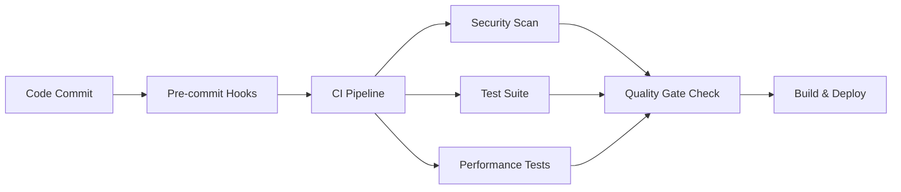

# CI/CD Pipeline Setup and Quality Gates

This document provides comprehensive guidance for the ITS Camera AI CI/CD pipeline infrastructure, quality gates, and monitoring setup.

## Overview

The CI/CD pipeline implements a comprehensive quality gate system with:

- **Code Coverage**: 90% minimum threshold enforced
- **Security Scanning**: Zero P0 (high/critical) security issues allowed
- **Performance Benchmarks**: Sub-100ms inference latency requirements
- **Pipeline Success Rate**: 95% target with monitoring
- **Automated Quality Checks**: Pre-commit hooks and CI validation

## Pipeline Architecture

### Quality Gates Structure



### Pipeline Success Rate Monitoring

The pipeline tracks success rates across all jobs:
- **Target**: 95% success rate
- **Measurement**: Rolling 30-day average
- **Alerting**: Below-threshold notifications
- **Metrics**: Exported to monitoring system

## Quality Gates

### 1. Code Coverage Gate

**Requirement**: ≥90% test coverage
**Implementation**: pytest with coverage reporting
**Enforcement**: CI pipeline fails if below threshold

```bash
pytest \
  --cov=src/its_camera_ai \
  --cov-fail-under=90 \
  --cov-report=xml \
  --cov-report=html
```

### 2. Security Gate

**Requirement**: Zero P0 (high/critical) security issues
**Tools**: Bandit, Safety, pip-audit
**Enforcement**: Pipeline fails on high/critical findings

```bash
# Security scanning with failure on critical issues
bandit -r src/ -f json -o bandit-report.json
jq '[.results[] | select(.issue_severity == "HIGH" or .issue_severity == "CRITICAL")] | length' bandit-report.json
```

### 3. Performance Gate

**Requirement**: 
- Inference latency <100ms (95th percentile)
- API response time <500ms (95th percentile)
**Implementation**: pytest-benchmark
**Enforcement**: Pipeline fails if benchmarks exceed thresholds

### 4. Type Safety Gate

**Requirement**: MyPy type checking passes
**Implementation**: Static type analysis
**Enforcement**: Pre-commit and CI validation

## Pre-commit Hook Configuration

### Quality Gates in Pre-commit

The pre-commit configuration implements progressive quality checks:

#### Pre-commit Stage (Fast)
- Code formatting (ruff, black)
- Import sorting (isort)
- Basic security checks
- Unit tests (fast subset)

#### Pre-push Stage (Comprehensive)
- Full test suite with coverage
- Security P0 check
- Code complexity analysis
- Type checking

### Installation

```bash
# Install pre-commit hooks
pre-commit install
pre-commit install --hook-type pre-push
pre-commit install --hook-type commit-msg

# Run all hooks manually
pre-commit run --all-files
```

## Monitoring Infrastructure

### Prometheus Configuration

The monitoring stack provides comprehensive observability:

#### Core Metrics Collection
- **Application metrics**: API latency, throughput, errors
- **Infrastructure metrics**: CPU, memory, disk, network
- **GPU metrics**: Utilization, memory, temperature
- **Database metrics**: Connections, query performance
- **Cache metrics**: Hit rates, memory usage

#### Service Discovery
- Kubernetes-native discovery
- Automatic target detection
- Label-based filtering
- Environment-specific monitoring

### Grafana Dashboards

#### System Overview Dashboard
- Service health status
- Performance KPIs
- Resource utilization
- SLO tracking

#### Performance Monitoring Dashboard
- Latency distribution
- Throughput metrics
- Error rate tracking
- Queue lengths

### Alerting Rules

#### SLO-Based Alerting
- **API Availability**: 99.9% target
- **Inference Availability**: 99.9% target
- **Latency SLOs**: P95 thresholds
- **Error Budget**: Burn rate monitoring

#### Infrastructure Alerting
- Resource utilization thresholds
- Service health checks
- GPU monitoring
- Database performance

## Pipeline Metrics and SLA

### Success Rate Tracking

```prometheus
# Pipeline success rate calculation
pipeline_success_rate = (successful_jobs / total_jobs) * 100

# Target SLA: 95%
# Measurement window: 30 days
# Alert threshold: <95%
```

### Performance Benchmarks

```yaml
Performance Targets:
  inference_latency_p95: <100ms
  api_latency_p95: <500ms
  test_execution_time: <5min
  build_time: <3min
```

## Security Scanning

### Multi-layer Security Checks

1. **Static Analysis** (Bandit)
   - Code vulnerability scanning
   - Security anti-patterns detection
   - Configuration security checks

2. **Dependency Scanning** (Safety, pip-audit)
   - Known vulnerability detection
   - Package security assessment
   - License compliance

3. **Container Scanning** (Future)
   - Image vulnerability assessment
   - Base image security validation
   - Runtime security policies

### Security Policy Enforcement

```yaml
Security Requirements:
  - Zero critical security issues
  - Zero high security issues
  - Known vulnerabilities: Immediate remediation
  - Dependency updates: Weekly review
```

## Environment-specific Configuration

### Production Pipeline
- Full quality gate enforcement
- Comprehensive testing
- Security scanning
- Performance validation
- Deployment automation

### Staging Pipeline
- Quality gate enforcement
- Integration testing
- Performance testing
- Canary deployments

### Development Pipeline
- Relaxed thresholds
- Fast feedback loops
- Developer-friendly alerts
- Optional quality checks

## Troubleshooting

### Common Pipeline Failures

#### Coverage Below Threshold
```bash
# Check coverage report
pytest --cov=src/its_camera_ai --cov-report=html
open htmlcov/index.html

# Add missing tests for uncovered code
```

#### Security Issues
```bash
# Review security findings
bandit -r src/ -f txt
safety check
pip-audit

# Address findings before commit
```

#### Performance Regression
```bash
# Run performance benchmarks
pytest --benchmark-only
pytest -m benchmark

# Profile specific functions
python -m cProfile -o profile.stats script.py
```

#### Import Issues
```bash
# Check import structure
mypy src/
python -c "import its_camera_ai; print('Import successful')"

# Fix circular imports or missing dependencies
```

## Continuous Improvement

### Pipeline Optimization
- Parallel job execution
- Caching strategies
- Incremental testing
- Selective execution

### Quality Metrics Evolution
- Coverage target increases
- New security rules
- Performance improvements
- Additional quality gates

### Monitoring Enhancement
- New dashboard creation
- Alert tuning
- SLO refinement
- Metric collection expansion

## Support and Resources

### Documentation Links
- [Pipeline Configuration](.github/workflows/ci.yml)
- [Pre-commit Setup](.pre-commit-config.yaml)
- [Monitoring Stack](docker-compose.monitoring.yml)
- [Quality Gates](pyproject.toml)

### Team Contacts
- **Platform Engineering**: platform-team@company.com
- **DevOps**: devops-team@company.com
- **Security**: security-team@company.com
- **SRE**: sre-team@company.com

### Emergency Procedures
- **Pipeline Down**: Contact DevOps team
- **Security Alert**: Contact Security team
- **Performance Issues**: Contact SRE team
- **Quality Gate Bypass**: Requires approval from tech lead